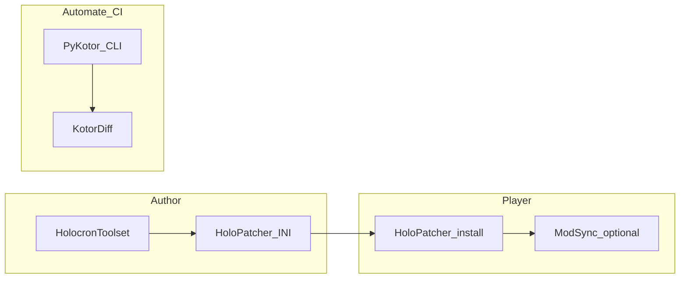

_This page is for people who need to understand how HoloPatcher actually works under the hood. If you just want to install a mod, start with [Installing Mods with HoloPatcher](https://github.com/OpenKotOR/PyKotor/wiki/Installing-Mods-with-HoloPatcher)._

HoloPatcher is best understood as three cooperating layers:

- the [UI/Interface](https://github.com/OpenKotOR/PyKotor/blob/92f5fb81a7b9642085c67b7b48ddd50f2df4378d/Tools/HoloPatcher/src/holopatcher/__main__.py)
- the [ConfigReader](https://github.com/OpenKotOR/PyKotor/blob/92f5fb81a7b9642085c67b7b48ddd50f2df4378d/Libraries/PyKotor/src/pykotor/tslpatcher/reader.py#L129)
- the [Patcher](https://github.com/OpenKotOR/PyKotor/blob/92f5fb81a7b9642085c67b7b48ddd50f2df4378d/Libraries/PyKotor/src/pykotor/tslpatcher/patcher.py) (see [The Patch Routine](#the-patch-routine))

Together, those layers parse installer configuration, build an ordered list of patch operations, and apply them against a target game installation with backup and logging behavior that is intentionally close to classic TSLPatcher semantics.

## Verified against source files

- [Tools/HoloPatcher/src/holopatcher/__main__.py](https://github.com/OpenKotOR/PyKotor/blob/92f5fb81a7b9642085c67b7b48ddd50f2df4378d/Tools/HoloPatcher/src/holopatcher/__main__.py)
- [Tools/HoloPatcher/src/holopatcher/app.py](https://github.com/OpenKotOR/PyKotor/blob/92f5fb81a7b9642085c67b7b48ddd50f2df4378d/Tools/HoloPatcher/src/holopatcher/app.py)
- [Tools/HoloPatcher/src/holopatcher/cli.py](https://github.com/OpenKotOR/PyKotor/blob/92f5fb81a7b9642085c67b7b48ddd50f2df4378d/Tools/HoloPatcher/src/holopatcher/cli.py)
- [Libraries/PyKotor/src/pykotor/tslpatcher/reader.py](https://github.com/OpenKotOR/PyKotor/blob/92f5fb81a7b9642085c67b7b48ddd50f2df4378d/Libraries/PyKotor/src/pykotor/tslpatcher/reader.py)
- [Libraries/PyKotor/src/pykotor/tslpatcher/patcher.py](https://github.com/OpenKotOR/PyKotor/blob/92f5fb81a7b9642085c67b7b48ddd50f2df4378d/Libraries/PyKotor/src/pykotor/tslpatcher/patcher.py)
- [Libraries/PyKotor/src/pykotor/tslpatcher/mods](https://github.com/OpenKotOR/PyKotor/tree/92f5fb81a7b9642085c67b7b48ddd50f2df4378d/Libraries/PyKotor/src/pykotor/tslpatcher/mods)

## Toolchain flow (high-level)

End-to-end story: **Holocron Toolset** and other editors produce assets; **HoloPatcher** INI describes install and merge steps; **players** run HoloPatcher against the **game root**; **PyKotor CLI** and **KotorDiff** support headless packaging and regression diffs; **KotORModSync** optionally helps manage multi-mod setups. This stack is complementary, not exclusive. Reader-facing overview and “when to use what” lives on [Home — KotOR modding toolchain](Home#documentation).



# UI/Interface

source code @ [Tools/HoloPatcher/src](https://github.com/OpenKotOR/PyKotor/blob/92f5fb81a7b9642085c67b7b48ddd50f2df4378d/Tools/HoloPatcher/src/holopatcher/__main__.py)

This is a simple **GUI interface** to _HoloPatcher_. What you'll find here:

- Tools such as:
  - [_fix iOS case sensitivity_](https://github.com/OpenKotOR/PyKotor/blob/92f5fb81a7b9642085c67b7b48ddd50f2df4378d/Tools/HoloPatcher/src/holopatcher/app.py#L970)
  - [_fix permissions_](https://github.com/OpenKotOR/PyKotor/blob/92f5fb81a7b9642085c67b7b48ddd50f2df4378d/Tools/HoloPatcher/src/holopatcher/app.py#L970)
- Top Menu options (discord links, about, help, etc)
- Loading Mod Path/Game paths into comboboxes
- [CLI parsing](https://github.com/OpenKotOR/PyKotor/blob/92f5fb81a7b9642085c67b7b48ddd50f2df4378d/Tools/HoloPatcher/src/holopatcher/__main__.py#L73)
- other UI stuff

The main purpose of this giant script is to run this function and ensure a streamlined user experience. All boils down to these two lines of code:

```python
# Construct the installer class instance object
installer = ModInstaller(namespace_mod_path, self.gamepaths.get(), ini_file_path, self.logger)
# Start the install
installer.install()
```

Note:

- When the `--install` option is passed, the `install()` call is [executed in the same thread](https://github.com/OpenKotOR/PyKotor/blob/92f5fb81a7b9642085c67b7b48ddd50f2df4378d/Tools/HoloPatcher/src/holopatcher/cli.py). When normal execution through the UI is used (i.e. a user presses 'install'), a [new thread will be created](https://github.com/OpenKotOR/PyKotor/blob/92f5fb81a7b9642085c67b7b48ddd50f2df4378d/Tools/HoloPatcher/src/holopatcher/app.py). This is done for proper handling of stdout/stderr.
- When the mod does not have a [namespaces.ini](https://github.com/OpenKotOR/PyKotor/blob/92f5fb81a7b9642085c67b7b48ddd50f2df4378d/Libraries/PyKotor/src/pykotor/tslpatcher/namespaces.py), holopatcher creates one internally with a single '[changes.ini](https://github.com/OpenKotOR/PyKotor/blob/92f5fb81a7b9642085c67b7b48ddd50f2df4378d/Libraries/PyKotor/src/pykotor/tslpatcher/config.py#L113)' entry. This is how the top combobox works and why it'll always have an entry despite a mod not providing a [namespaces.ini](https://github.com/OpenKotOR/PyKotor/blob/92f5fb81a7b9642085c67b7b48ddd50f2df4378d/Libraries/PyKotor/src/pykotor/tslpatcher/namespaces.py).

# [ConfigReader](https://github.com/OpenKotOR/PyKotor/blob/92f5fb81a7b9642085c67b7b48ddd50f2df4378d/Libraries/PyKotor/src/pykotor/tslpatcher/reader.py#L129)

source code @ [pykotor.tslpatcher.reader](https://github.com/OpenKotOR/PyKotor/blob/92f5fb81a7b9642085c67b7b48ddd50f2df4378d/Libraries/PyKotor/src/pykotor/tslpatcher/reader.py)

the [ConfigReader](https://github.com/OpenKotOR/PyKotor/blob/92f5fb81a7b9642085c67b7b48ddd50f2df4378d/Libraries/PyKotor/src/pykotor/tslpatcher/reader.py#L129) is responsible for parsing a [changes.ini](https://github.com/OpenKotOR/PyKotor/blob/92f5fb81a7b9642085c67b7b48ddd50f2df4378d/Libraries/PyKotor/src/pykotor/tslpatcher/config.py#L113) and accumulating the patches to execute. This happens immediately when the mod is loaded by the user or when swapping options in the namespaces comboboxes. As such, any errors/exceptions/crashes that happen in reader code will _always_ be before the patcher modifies game files.

# Patcher

source code @ [pykotor.tslpatcher.patcher](https://github.com/OpenKotOR/PyKotor/blob/92f5fb81a7b9642085c67b7b48ddd50f2df4378d/Libraries/PyKotor/src/pykotor/tslpatcher/patcher.py)

The patcher itself handles all the errors/output/modifications of the patches accumulated by the [ConfigReader](https://github.com/OpenKotOR/PyKotor/blob/92f5fb81a7b9642085c67b7b48ddd50f2df4378d/Libraries/PyKotor/src/pykotor/tslpatcher/reader.py#L129).

## PatchLists

source code @ [pykotor.tslpatcher.mods](https://github.com/OpenKotOR/PyKotor/tree/92f5fb81a7b9642085c67b7b48ddd50f2df4378d/Libraries/PyKotor/src/pykotor/tslpatcher/mods)

Each Python module under `tslpatcher/mods` implements a different patch list. Examples:

- [GFFList](TSLPatcher-GFFList-Syntax) — [`gff.py`](https://github.com/OpenKotOR/PyKotor/blob/92f5fb81a7b9642085c67b7b48ddd50f2df4378d/Libraries/PyKotor/src/pykotor/tslpatcher/mods/gff.py)
- [CompileList](TSLPatcher's-Official-Readme) (NSS compile) — [`nss.py`](https://github.com/OpenKotOR/PyKotor/blob/92f5fb81a7b9642085c67b7b48ddd50f2df4378d/Libraries/PyKotor/src/pykotor/tslpatcher/mods/nss.py)
- [SSFList](TSLPatcher's-Official-Readme) — [`ssf.py`](https://github.com/OpenKotOR/PyKotor/blob/92f5fb81a7b9642085c67b7b48ddd50f2df4378d/Libraries/PyKotor/src/pykotor/tslpatcher/mods/ssf.py)
- [2DAList](TSLPatcher-2DAList-Syntax) — [`twoda.py`](https://github.com/OpenKotOR/PyKotor/blob/92f5fb81a7b9642085c67b7b48ddd50f2df4378d/Libraries/PyKotor/src/pykotor/tslpatcher/mods/twoda.py)
- [TLKList](TSLPatcher-TLKList-Syntax) — [`tlk.py`](https://github.com/OpenKotOR/PyKotor/blob/92f5fb81a7b9642085c67b7b48ddd50f2df4378d/Libraries/PyKotor/src/pykotor/tslpatcher/mods/tlk.py)
- [HACKList](TSLPatcher-HACKList-Syntax) / NCS — [`ncs.py`](https://github.com/OpenKotOR/PyKotor/blob/92f5fb81a7b9642085c67b7b48ddd50f2df4378d/Libraries/PyKotor/src/pykotor/tslpatcher/mods/ncs.py)
- [InstallList](TSLPatcher-InstallList-Syntax) — [`install.py`](https://github.com/OpenKotOR/PyKotor/blob/92f5fb81a7b9642085c67b7b48ddd50f2df4378d/Libraries/PyKotor/src/pykotor/tslpatcher/mods/install.py)

As can be seen each class inherits [PatcherModifications](https://github.com/OpenKotOR/PyKotor/blob/92f5fb81a7b9642085c67b7b48ddd50f2df4378d/Libraries/PyKotor/src/pykotor/tslpatcher/mods/template.py#L25). This causes the following behavior:

- Each patch list will always contain the same [TSLPatcher exclamation-point variables](https://github.com/OpenKotOR/PyKotor/blob/92f5fb81a7b9642085c67b7b48ddd50f2df4378d/Libraries/PyKotor/src/pykotor/tslpatcher/mods/template.py#L53). Some patch lists may have different handling of each variable. Examples:
  - [TLK handling](https://github.com/OpenKotOR/PyKotor/blob/92f5fb81a7b9642085c67b7b48ddd50f2df4378d/Libraries/PyKotor/src/pykotor/tslpatcher/mods/tlk.py#L40)
  - [NCS handling](https://github.com/OpenKotOR/PyKotor/blob/92f5fb81a7b9642085c67b7b48ddd50f2df4378d/Libraries/PyKotor/src/pykotor/tslpatcher/mods/ncs.py#L69)
  This shows that everything follows more-or-less the same patch routine, which we will talk about in the next section:

## The Patch Routine

source code @ [pykotor.tslpatcher.patcher](https://github.com/OpenKotOR/PyKotor/blob/92f5fb81a7b9642085c67b7b48ddd50f2df4378d/Libraries/PyKotor/src/pykotor/tslpatcher/patcher.py#L326)

The patch routine will execute all loaded [changes.ini](https://github.com/OpenKotOR/PyKotor/blob/92f5fb81a7b9642085c67b7b48ddd50f2df4378d/Libraries/PyKotor/src/pykotor/tslpatcher/config.py#L113) patches in a single thread.

### Patchlist Priority Order

The following is the patchlist order of operations (earliest executed to last-executed)

```python
patches_list: list[PatcherModifications] = [
    *config.install_list,  # Note: TSLPatcher executes [InstallList] after [TLKList]
    *self.get_tlk_patches(config),
    *config.patches_2da,
    *config.patches_gff,
    *config.patches_nss,
    *config.patches_ncs,   # Note: TSLPatcher executes [CompileList] after [HACKList]
    *config.patches_ssf,
]
```

The priority order has been changed for various reasons, mostly relating to useability. For example, if a mod wanted to overwrite a whole [dialog.tlk](Audio-and-Localization-Formats#tlk) for some reason it makes sense that InstallList patch should run before TLKList. As for the compilelist vs hacklist discrepancy, it makes more sense that users would want to compile a script and then potentially edit the [NCS](NCS-File-Format).

We doubt these priority order changes will affect the output of any mods. If you discover one, please report an issue.

### Final Validations Before Modifications

- Patcher will once again check if [changes.ini](https://github.com/OpenKotOR/PyKotor/blob/92f5fb81a7b9642085c67b7b48ddd50f2df4378d/Libraries/PyKotor/src/pykotor/tslpatcher/config.py#L113) is found on disk
- Patcher will determine if the kotor directory is valid. Uses various heuristics of what's known about the files to safely determine if it's TSL or k1.

- **Prepare the [CompileList]:** Before the patch loop runs, the patcher will first copy all the files in the namespace tslpatchdata folder matching '.nss' extension to a temporary directory. If there is a 'nwscript.nss', it will automatically append a patch to [InstallList] the nwscript.nss to the Override folder. This is done because some versions of nwnnsscomp.exe will rely on nwscript.nss being in Override rather than tslpatchdata. Specifically the KOTOR Tool version of nwnnsscomp.exe

### **_The Patch Loop_**

source code @ [pykotor.tslpatcher.patcher](https://github.com/OpenKotOR/PyKotor/blob/92f5fb81a7b9642085c67b7b48ddd50f2df4378d/Libraries/PyKotor/src/pykotor/tslpatcher/patcher.py#L356)

HoloPatcher is _finally_ ready to start applying the patches and modifying the installation. A simple `for patch in all_patches` loop runs, wrapped in a `try-except`. The try-except behavior is directly what TSLPatcher itself will do. Anytime a specific patch fails, it'll log the error and continue the next one.

**Step 1:** The patch routine first determines whether the mod is intending to be installed into a capsule, and if the file/resource to be patched already exists in the KOTOR path.

- If the resource exists, back it up to a timestamped directory in the `backup` folder.
- If the resource does not exist, write the patch's intended filepath into the `remove these files.txt` file.
- If the patch intends to install into a capsule (`.mod` / `.erf` / [`.rim`](Container-Formats#rim) / `.sav`) and the capsule DOES NOT exist, throw a FileNotFoundError (matches tslpatcher behavior)

**Step 2: [Log the operation](https://github.com/OpenKotOR/PyKotor/blob/92f5fb81a7b9642085c67b7b48ddd50f2df4378d/Libraries/PyKotor/src/pykotor/tslpatcher/patcher.py#L265)**, such as `patching existing file in the 'path' folder'.

- Note: [Replacements are handled differently (src code `skip_if_not_replace=True`)](https://github.com/OpenKotOR/PyKotor/blob/92f5fb81a7b9642085c67b7b48ddd50f2df4378d/Libraries/PyKotor/src/pykotor/tslpatcher/mods/template.py#L41) for both [CompileList] and [InstallList]

**Step 3: Lookup the Resource to Patch**: Determine [where to find the source file](https://github.com/OpenKotOR/PyKotor/blob/92f5fb81a7b9642085c67b7b48ddd50f2df4378d/Libraries/PyKotor/src/pykotor/tslpatcher/patcher.py#L191) that should be patched.

- Check if file should be replaced or doesn't exist at output. If either condition passes, load from the mod path
- Otherwise, load the file to be patched from the destination if it exists.
  - If the resource is encapsulated, it's a file and load it directly as a file from the destination
  - If destination is intended to be inside of a capsule, pull the resource from the capsule.
- Log error on failure (IO exceptions, permission issues, etc.)

**Step 4: Patch the resource found in step 3.**: Apply the modifications to the source file determined by step 3.

- If holopatcher determined that there's nothing to write back to disk (e.g. [CompileList] was called on an include file), continue to the next patch and stop here.

**Step 5. Handle `!OverrideType`**: A widely unknown TSLPatcher feature is configurable nature of override handling. If a file is being installed into a capsule, and that file already exists in Override, there are 3 actions that the patcher can be configured with:

```python
class OverrideType:
    """Possible actions for how the patcher should behave when patching a file to a ERF/MOD/RIM while that filename already exists in the Override folder."""

    IGNORE = "ignore"  # Do nothing: don't even check (TSLPatcher default)
    WARN   = "warn"    # Log a warning (HoloPatcher default)
    RENAME = "rename"  # Rename the file in the Override folder with the 'old_' prefix. Also logs a warning.
```

Capsule formats:

- [ERF / MOD](Container-Formats#erf)
- [RIM](Container-Formats#rim)

[RIM versus ERF](Container-Formats#rim-versus-erf) compares the on-disk layouts.

source code @ [tslpatcher.mods.template](https://github.com/OpenKotOR/PyKotor/blob/92f5fb81a7b9642085c67b7b48ddd50f2df4378d/Libraries/PyKotor/src/pykotor/tslpatcher/mods/template.py#L25)

**Step 6: Save the resource**: Save the resource to the KOTOR path on disk. `!DefaultDestination` and `!Destination` and `!Filename`/`!SaveAs` configure this.

**Step 7:** Repeat from **Step 1** for the next patch, until all patches have been completed.

### All patches complete, cleanup

**Step 8: Cleanup post-processed scripts**: If [`SaveProcessedScripts=0`](https://github.com/OpenKotOR/PyKotor/blob/92f5fb81a7b9642085c67b7b48ddd50f2df4378d/Libraries/PyKotor/src/pykotor/tslpatcher/patcher.py#L395) or not available in the [changes.ini](https://github.com/OpenKotOR/PyKotor/blob/92f5fb81a7b9642085c67b7b48ddd50f2df4378d/Libraries/PyKotor/src/pykotor/tslpatcher/config.py#L113), cleanup the temp folder created in the **Final Validations**.

**Step 8:** Calculate the total patches completed.

### See also

- [Installing Mods with HoloPatcher](Installing-Mods-with-HoloPatcher) — User installation
- [HoloPatcher README for Mod Developers](HoloPatcher-README-for-mod-developers) — Mod development
- [TSLPatcher's Official Readme](TSLPatcher's-Official-Readme) — TSLPatcher syntax
- [TSLPatcher GFFList Syntax](TSLPatcher-GFFList-Syntax)
- [TSLPatcher InstallList Syntax](TSLPatcher-InstallList-Syntax)
- [Container-Formats#key](Container-Formats#key) — Resource resolution
