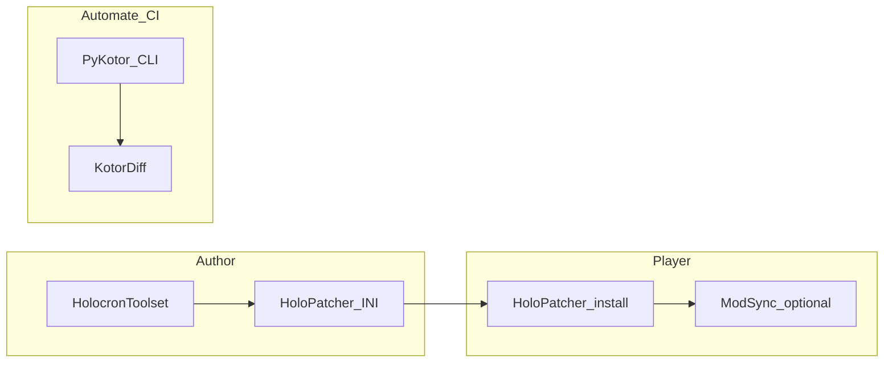

# HoloPatcher

This page groups HoloPatcher documentation for both mod developers and end users.

## Contents

- [HoloPatcher for Mod Developers](#mod-developers)
- [Installing Mods with HoloPatcher](#installing-mods)
- [HoloPatcher Internal Logic](#internal-logic)

---

<a id="mod-developers"></a>

_This page explains how to package and test a mod with HoloPatcher. If you are installing a mod as a player, see [Installing Mods with HoloPatcher](HoloPatcher#installing-mods)._

## Creating a HoloPatcher mod

HoloPatcher is PyKotor's modern implementation of the TSLPatcher workflow. For mod authors, the main promise is continuity: the patch format stays compatible with established TSLPatcher packaging, while the surrounding tooling is easier to inspect, test, and extend.

Start with [TSLPatcher's Official Readme](TSLPatcher's-Official-Readme) if you need the original syntax reference. Use this page for the practical author workflow, current PyKotor-backed behavior, and the places where HoloPatcher documents features more clearly than the historical readme did.

**Verified against source files:**

- `Libraries/PyKotor/src/pykotor/tslpatcher/` - core parser, patch model, and merge logic
- `Libraries/PyKotor/src/pykotor/tslpatcher/mods/` - per-format patch implementations
- `Tools/HoloPatcher/src/holopatcher/` - GUI flow, namespace handling, logging, and backup behavior

**Implementation:** [`Libraries/PyKotor/src/pykotor/tslpatcher/`](https://github.com/OldRepublicDevs/PyKotor/tree/master/Libraries/PyKotor/src/pykotor/tslpatcher/)

**Other mod installers and managers:**

- **[TSLPatcher](https://github.com/Fair-Strides/TSLPatcher)** - Original Perl TSLPatcher by stoffe (reference implementation)
- **[Kotor-Patch-Manager](https://github.com/LaneDibello/Kotor-Patch-Manager)** - Alternative mod manager with different patching approach
- **KotORModSync** — Multi-mod workflows, profiles, and install orchestration (complements HoloPatcher; does not replace INI patch semantics)

  - Canonical (th3w1zard1/KotORModSync): <https://github.com/th3w1zard1/KotORModSync/tree/c8b0d10ce3fd7525d593d34a3be8d151da7d3387>

**KotORModSync in practice:** Use HoloPatcher (or equivalent) to **apply** each mod’s `tslpatchdata` to a game root. Use **KotORModSync** when you need help **tracking**, ordering, or syncing many installs across folders or team members. It is **not** a drop-in substitute for reading `[2DAList]` / `[TLKList]` rules—those remain defined by TSLPatcher/HoloPatcher INI. Repository: **`th3w1zard1/KotORModSync`** (verify file paths on the repo default branch before adding deep `#L` links in the wiki).

**Community context:** End users and mod authors often coordinate around [Deadly Stream — HoloPatcher](https://deadlystream.com/files/file/2243-holopatcher/) (downloads + discussion). Large distributions such as [KOTOR 1 Community Patch](https://deadlystream.com/files/file/1258-kotor-1-community-patch/) show what real-world HoloPatcher packaging looks like. Use those releases for workflow examples and player expectations; use this wiki and the TSLPatcher syntax pages as the source of truth for INI semantics.

**Related PyKotor Tools:**

- [`Tools/HolocronToolset/`](https://github.com/OldRepublicDevs/PyKotor/tree/master/Tools/HolocronToolset) - Integrated HoloPatcher [GUI](GFF-File-Format#gui-graphical-user-interface)
- [`Libraries/PyKotor/src/pykotor/tslpatcher/mods/`](https://github.com/OldRepublicDevs/PyKotor/tree/master/Libraries/PyKotor/src/pykotor/tslpatcher/mods) - Individual patching modules

### See also

- [TSLPatcher's Official Readme](TSLPatcher's-Official-Readme) - Original documentation
- [Installing Mods with HoloPatcher](HoloPatcher#installing-mods) - Player-facing install and restore flow
- [TSLPatcher InstallList Syntax](TSLPatcher-Install-and-Hack-Syntax#installlist-syntax) - file installation
- [TSLPatcher TLKList Syntax](TSLPatcher-Data-Syntax#tlklist-syntax) - [TLK](Audio-and-Localization-Formats#tlk) patching
- [TSLPatcher 2DAList Syntax](TSLPatcher-Data-Syntax#2dalist-syntax) - [2DA](2DA-File-Format) patching
- [TSLPatcher GFFList Syntax](TSLPatcher-GFF-Syntax#gfflist-syntax) - [GFF](GFF-File-Format) patching
- [TSLPatcher SSFList Syntax](TSLPatcher-GFF-Syntax#ssflist-syntax) - [SSF](Audio-and-Localization-Formats#ssf) patching
- [TSLPatcher HACKList Syntax](TSLPatcher-Install-and-Hack-Syntax#hacklist-syntax) - Advanced [NCS](NCS-File-Format) binary patching
- [Explanations on HoloPatcher Internal Logic](HoloPatcher#internal-logic) - Internal component flow and patch-routine behavior
- [Mod Creation Best Practices](Mod-Creation-Best-Practices) - General modding guidelines

## Walkthrough: first HoloPatcher mod (TLK + 2DA + InstallList)

**Goal:** Ship a minimal TSLPatcher-compatible package that adds a dialog string, touches one [2DA](2DA-File-Format) row, and installs one loose file without replacing whole vanilla tables.

**Prerequisites:**

- [TSLPatcher's Official Readme](TSLPatcher's-Official-Readme) (skim)
- Syntax references open while you work:
  - [InstallList](TSLPatcher-Install-and-Hack-Syntax#installlist-syntax)
  - [TLKList](TSLPatcher-Data-Syntax#tlklist-syntax)
  - [2DAList](TSLPatcher-Data-Syntax#2dalist-syntax)
- HoloPatcher pointed at a **test** game copy

**Steps:**

1. **Layout:** `YourMod/tslpatchdata/changes.ini` plus any side files (e.g. `mymod.tlk` fragment, source 2DA snippet, loose file to copy).
2. **TLK:** In `[TLKList]`, reference a TLK patch file and add or modify rows per [TSLPatcher TLKList Syntax](TSLPatcher-Data-Syntax#tlklist-syntax). Prefer **merge** operations over replacing entire `dialog.tlk` unless you intend a total replacement (replace-style examples appear under **[TLK](Audio-and-Localization-Formats#tlk) replacements** in [HoloPatcher changes](#holopatcher-changes--new-features) below).
3. **2DA:** In `[2DAList]`, target a small change (e.g. append one row to a non-critical table in the test install) using [TSLPatcher 2DAList Syntax](TSLPatcher-Data-Syntax#2dalist-syntax). Use `2DAMEMORY`/labels so later steps can reference row indices if needed.
4. **InstallList:** Add `[InstallList]` entries to copy **one** file (e.g. a test `.nss` or texture) into `override/` or `modules/` per [TSLPatcher InstallList Syntax](TSLPatcher-Install-and-Hack-Syntax#installlist-syntax).
5. **Namespaces:** If you offer variants, add `namespaces.ini`; otherwise one `changes.ini` is enough.
6. **Install and inspect:** Run HoloPatcher against a test install and read the log before you launch the game.

**Verify in-game:** Confirm the loose file appears where expected, then confirm the TLK and 2DA changes in a tool or test dialogue before shipping.

**Alternatives:** For learning GFF-only flows, follow [Tutorial: Creating a new store](Tutorial-Creating-a-New-Store) in Holocron. For headless builds, use [CLI quickstart](https://github.com/OldRepublicDevs/PyKotor/blob/master/Libraries/PyKotor/CLI_QUICKSTART.md).

**Common failures:** pointing the patcher at `override/` instead of the **game root**, reinstalling the same option without [restore backup](HoloPatcher#installing-mods), and shipping bad relative paths in InstallList. See [Mod Creation Best Practices](Mod-Creation-Best-Practices#tslpatcher-setup-and-2datlk-merging).

## HoloPatcher changes & New Features

### [TLK](Audio-and-Localization-Formats#tlk) replacements

- This is not recommended under most scenarios. You usually want to append a new entry and update your DLGs to point to it using [StrRef](Audio-and-Localization-Formats#string-references-strref) in the ini. However for projects like the k1cp and mods that fix grammatical/spelling mistakes, this may be useful.

The basic syntax is:

```ini
[TLKList]
ReplaceFile0=tlk_modifications_file.tlk

[tlk_modifications_file.tlk]
StrRef0=2
```

This will replace StrRef0 in [dialog.tlk](Audio-and-Localization-Formats#tlk) with StrRef2 from `tlk_modifications_file.tlk`.

[See our tests](https://github.com/OldRepublicDevs/PyKotor/blob/a8daa4091b067e8424ae537793224e6b178ee9d8/tests/test_tslpatcher/test_reader.py#L463) for more examples.
Don't use the 'ignore' syntax or the 'range' syntax, these won't be documented or supported until further notice.

### HACKList (Editing [NCS](NCS-File-Format) directly)

This is a TSLPatcher feature that was [not documented in the TSLPatcher readme](https://github.com/OldRepublicDevs/PyKotor/wiki/TSLPatcher's-Official-Readme). Public examples are rare. The main known references are [Stoffe's HLFP mod](https://deadlystream.com/files/file/832-high-level-force-powers/) and a few historical forum archives.

Due to this feature being highly undocumented and only one known usage, our implementation might not match exactly. If you happen to find an old TSLPatcher mod that produces different HACKList results than HoloPatcher, [please report them here](https://github.com/OldRepublicDevs/PyKotor/issues/24)

In continuation, HoloPatcher's [HACKList] will use the following syntax:

```ini
[HACKList]
File0=script_to_modify.NCS

[script_to_modify.ncs]
20=StrRef5
40=2DAMEMORY10
60=65535
```

This will:

- Modify offset dec 20 (hex 0x14) of `script_to_modify.ncs` and overwrite that offset with the value of StrRef5.
- Modify offset dec 40 (hex 0x28) of `script_to_modify.ncs` and overwrite that offset with the value of 2DAMEMORY10.
- Modify offset dec 60 (hex 0x3C) of `script_to_modify.ncs` and overwrite that offset with the value of dec 65535 (hex 0xFFFF) i.e. the maximum possible value.
In short, HACKList writes unsigned WORD values (two bytes each) to the [NCS](NCS-File-Format) offsets named in the INI.

### For more information on HoloPatcher's implementation

#### [pykotor.tslpatcher.reader](https://github.com/OldRepublicDevs/PyKotor/blob/a8daa4091b067e8424ae537793224e6b178ee9d8/Libraries/PyKotor/src/pykotor/tslpatcher/reader.py#L697)

#### [pykotor.tslpatcher.mods.ncs](https://github.com/OldRepublicDevs/PyKotor/blob/a8daa4091b067e8424ae537793224e6b178ee9d8/Libraries/PyKotor/src/pykotor/tslpatcher/mods/ncs.py)

### See also

- [Installing Mods with HoloPatcher](HoloPatcher#installing-mods) -- End-user installation
- [TSLPatcher's Official Readme](TSLPatcher's-Official-Readme) -- TSLPatcher syntax
- [TSLPatcher TLKList](TSLPatcher-Data-Syntax#tlklist-syntax)
- [TSLPatcher SSFList](TSLPatcher-GFF-Syntax#ssflist-syntax) -- Other patch lists
- [Explanations on HoloPatcher Internal Logic](HoloPatcher#internal-logic) -- Implementation
- [KEY-File-Format](Container-Formats#key) -- Resource resolution
- [Community sources and archives](Home#community-sources-and-archives) -- DeadlyStream, LucasForums for patching workflows


---

<a id="installing-mods"></a>

# Using HoloPatcher: Installation and Reversion

_This page explains how to install mods with HoloPatcher. If you are packaging a mod, see [HoloPatcher README for Mod Developers](HoloPatcher#mod-developers)._

HoloPatcher is the modern PyKotor implementation of the TSLPatcher workflow. For players, the important part is simple: point it at the right game folder, install one mod option at a time, and use its restore flow before retrying or switching variants.

## Before you install

- Point HoloPatcher at your **game root directory**: the folder containing `swkotor.exe` or `swkotor2.exe`, plus folders such as `override`, `modules`, and `lips`.
- Keep a clean backup or a disposable test install if you are testing several mods.
- Install one mod at a time when checking compatibility.
- If a mod offers multiple options, use the built-in backup/restore before changing options or reinstalling.

**Verified against source files:**

- `Libraries/PyKotor/src/pykotor/tslpatcher/` - patching semantics and install workflow
- `Tools/HoloPatcher/src/holopatcher/` - application behavior, backup/restore flow, and iOS utilities
- `Libraries/PyKotor/src/pykotor/extract/installation.py` - game-root detection context used elsewhere in the toolchain

See [Mod Creation Best Practices](Mod-Creation-Best-Practices#testing-and-compatibility) for compatibility guidance and [Concepts](Concepts) for override and resource-order background.

### Community downloads and player-oriented guides

- **HoloPatcher on Deadly Stream:** [file page + comments](https://deadlystream.com/files/file/2243-holopatcher/) — downloads and release notes
- [TOOL: HoloPatcher topic](https://deadlystream.com/topic/9807-toolholopatcher/) — install/merge Q&A (this wiki remains SSOT for patcher _behavior_; threads are _context_).
- **Large distribution example:** [KOTOR 1 Community Patch](https://deadlystream.com/files/file/1258-kotor-1-community-patch/) — real-world HoloPatcher packaging; always read the mod’s current readme for your game edition.
- **Generic PC setup (paths, widescreen, common fixes):**
  - [PCGamingWiki — KotOR](https://www.pcgamingwiki.com/wiki/Star_Wars:_Knights_of_the_Old_Republic)
  - [KotOR II: TSL](https://www.pcgamingwiki.com/wiki/Star_Wars:_Knights_of_the_Old_Republic_II_-_The_Sith_Lords)
  - [Series hub](https://www.pcgamingwiki.com/wiki/Series:Star_Wars:_Knights_of_the_Old_Republic)
  - Player-facing install notes only—**not** authoritative for KEY/BIF semantics or override resolution:
    - [KEY-File-Format](Container-Formats#key)
    - [Concepts](Concepts)
- **Historical forum context:** [LucasForums Archive — newbie tools + how to install mods](https://www.lucasforumsarchive.com/thread/129789-guide-for-the-newbie-what-tools-do-i-need-to-mod-kotor-how-to-install-mods) (legacy tool lists; cross-check with this wiki and Deadly Stream file hubs). [Installing a mod without TSLPatcher (e.g. Mac / manual)](https://www.lucasforumsarchive.com/thread/180751-how-do-install-a-mod-without-tsl-patcher) illustrates why **merge-aware** installers remain important for many releases.
- **TSLPatcher lineage (read for history, use HoloPatcher today):** [TSLPatcher v1.2.10b1 release thread](https://www.lucasforumsarchive.com/thread/149285-tslpatcher-v1210b1-mod-installer) — original mod-installer design goals. [Can't get TSL Patcher to work anymore](https://www.lucasforumsarchive.com/thread/206390-argh-cant-get-tsl-patcher-to-work-for-me-anymore) — typical override/path confusion; compare with steps above and [Concepts](Concepts#override-folder).
- **2DA merge pain (why whole-file overrides fail):** [spells.2da, compatibility and TSL Patcher](https://www.lucasforumsarchive.com/thread/205823-spells2da-compatibility-and-tsl-patcher) — workflow story; wiki SSOT for syntax remains [TSLPatcher-2DAList-Syntax](TSLPatcher-Data-Syntax#2dalist-syntax) / [2DA-spells](2DA-File-Format#spells2da).

## Install a mod

1. **Select the mod folder.** This is the folder that contains `tslpatchdata`.
2. **Select the game directory.** Choose your KotOR game root, not the `override` folder by itself.
3. **Choose an installation option, if present.** Mods with `namespaces.ini` expose one or more variants in the first dropdown.
4. **Run Install.** Review the log if anything fails instead of immediately retrying.

If the author ships extra instructions for Steam, GOG, Aspyr, or mobile builds, follow those too. HoloPatcher handles merge-aware patching, but it cannot correct a mod package that targets the wrong game version or wrong install path.

## KotORModSync (optional)

**KotORModSync** (**`th3w1zard1/KotORModSync`**) helps manage **many mods** or **multiple install targets** (profiles, sync between folders, team handoffs). It is **complementary** to HoloPatcher: you still need a valid TSLPatcher/HoloPatcher INI workflow for merges inside `tslpatchdata`. If you only install a handful of mods, following each mod’s readme + HoloPatcher is enough; if you maintain parallel installs or large lists, ModSync can reduce manual bookkeeping. See [HoloPatcher README for Mod Developers](HoloPatcher#mod-developers) (first-mod walkthrough section) for author-side packaging context.

- Canonical (th3w1zard1/KotORModSync): <https://github.com/th3w1zard1/KotORModSync/tree/c8b0d10ce3fd7525d593d34a3be8d151da7d3387>

## Reverting Mod Installations

To undo the most recent installation, use **Tools -> Uninstall Mod/Restore Backup**. That restores files to the state they were in immediately before that install ran.

### Why reinstalling without restoring is risky

- **Interrupted installs can duplicate changes.** If you close the app mid-install and then run the same option again, merge targets such as [appearance.2da](2DA-File-Format#appearance2da) can end up with duplicate rows or repeated edits.
- **Retrying the same option stacks changes.** HoloPatcher treats each install as a new operation and keeps a backup for each one.

If you installed the same thing twice by mistake, restore twice:

1. The first restore undoes the most recent installation.
2. The second restore undoes the earlier one and returns you to the pre-install state.

## Installing Mods on iOS Devices

iOS builds are case-sensitive in ways the desktop releases are not. If KotOR asset names keep uppercase characters where the mobile port expects lowercase, the game can crash immediately after you press Play.

HoloPatcher includes an iOS fix-up utility for this:

- Go to **Tools -> Fix iOS Case Sensitivity**.
- Point it at your KotOR install folder.
  - ! If you are instead patching the mobile TSLRCM layout, point it at the `mtslrcm` folder when the mod instructions call for that layout.

Run that fix before troubleshooting deeper compatibility issues on iOS. A surprising number of "instant crash on launch" reports turn out to be filename-case problems rather than bad mod content.

### See also

- [HoloPatcher README for Mod Developers](HoloPatcher#mod-developers) -- Mod development and patching syntax
- [TSLPatcher's Official Readme](TSLPatcher's-Official-Readme) -- Preserved legacy source for original TSLPatcher behavior
- [TSLPatcher_Thread_Complete](TSLPatcher_Thread_Complete) -- Preserved historical release and discussion archive
- [TSLPatcher-InstallList-Syntax](TSLPatcher-Install-and-Hack-Syntax#installlist-syntax) -- Exact author-facing InstallList semantics
- [TSLPatcher-TLKList-Syntax](TSLPatcher-Data-Syntax#tlklist-syntax) -- Exact author-facing TLKList semantics
- [TSLPatcher-2DAList-Syntax](TSLPatcher-Data-Syntax#2dalist-syntax) -- Exact author-facing 2DAList semantics
- [TSLPatcher-GFFList-Syntax](TSLPatcher-GFF-Syntax#gfflist-syntax) -- Exact author-facing GFFList semantics
- [Mod Creation Best Practices](Mod-Creation-Best-Practices) -- Workarounds and compatibility
- [KEY-File-Format](Container-Formats#key) -- Resource resolution and override order
- [2DA-File-Format](2DA-File-Format) -- Game data tables (e.g. appearance.2da)
- [Community sources and archives](Home#community-sources-and-archives) -- DeadlyStream, forums for troubleshooting and guides


---

<a id="internal-logic"></a>

_This page is for people who need to understand how HoloPatcher actually works under the hood. If you just want to install a mod, start with [Installing Mods with HoloPatcher](https://github.com/OldRepublicDevs/PyKotor/wiki/Installing-Mods-with-HoloPatcher)._

HoloPatcher is best understood as three cooperating layers:

- the [UI/Interface](https://github.com/OldRepublicDevs/PyKotor/blob/92f5fb81a7b9642085c67b7b48ddd50f2df4378d/Tools/HoloPatcher/src/holopatcher/__main__.py)
- the [ConfigReader](https://github.com/OldRepublicDevs/PyKotor/blob/92f5fb81a7b9642085c67b7b48ddd50f2df4378d/Libraries/PyKotor/src/pykotor/tslpatcher/reader.py#L129)
- the [Patcher](https://github.com/OldRepublicDevs/PyKotor/blob/92f5fb81a7b9642085c67b7b48ddd50f2df4378d/Libraries/PyKotor/src/pykotor/tslpatcher/patcher.py) (see [The Patch Routine](#the-patch-routine))

Together, those layers parse installer configuration, build an ordered list of patch operations, and apply them against a target game installation with backup and logging behavior that is intentionally close to classic TSLPatcher semantics.

## Verified against source files

- [Tools/HoloPatcher/src/holopatcher/__main__.py](https://github.com/OldRepublicDevs/PyKotor/blob/92f5fb81a7b9642085c67b7b48ddd50f2df4378d/Tools/HoloPatcher/src/holopatcher/__main__.py)
- [Tools/HoloPatcher/src/holopatcher/app.py](https://github.com/OldRepublicDevs/PyKotor/blob/92f5fb81a7b9642085c67b7b48ddd50f2df4378d/Tools/HoloPatcher/src/holopatcher/app.py)
- [Tools/HoloPatcher/src/holopatcher/cli.py](https://github.com/OldRepublicDevs/PyKotor/blob/92f5fb81a7b9642085c67b7b48ddd50f2df4378d/Tools/HoloPatcher/src/holopatcher/cli.py)
- [Libraries/PyKotor/src/pykotor/tslpatcher/reader.py](https://github.com/OldRepublicDevs/PyKotor/blob/92f5fb81a7b9642085c67b7b48ddd50f2df4378d/Libraries/PyKotor/src/pykotor/tslpatcher/reader.py)
- [Libraries/PyKotor/src/pykotor/tslpatcher/patcher.py](https://github.com/OldRepublicDevs/PyKotor/blob/92f5fb81a7b9642085c67b7b48ddd50f2df4378d/Libraries/PyKotor/src/pykotor/tslpatcher/patcher.py)
- [Libraries/PyKotor/src/pykotor/tslpatcher/mods](https://github.com/OldRepublicDevs/PyKotor/tree/92f5fb81a7b9642085c67b7b48ddd50f2df4378d/Libraries/PyKotor/src/pykotor/tslpatcher/mods)

## Toolchain flow (high-level)

End-to-end story: **Holocron Toolset** and other editors produce assets; **HoloPatcher** INI describes install and merge steps; **players** run HoloPatcher against the **game root**; **PyKotor CLI** and **KotorDiff** support headless packaging and regression diffs; **KotORModSync** optionally helps manage multi-mod setups. This stack is complementary, not exclusive. Reader-facing overview and “when to use what” lives on [Home — KotOR modding toolchain](Home#documentation).



# UI/Interface

source code @ [Tools/HoloPatcher/src](https://github.com/OldRepublicDevs/PyKotor/blob/92f5fb81a7b9642085c67b7b48ddd50f2df4378d/Tools/HoloPatcher/src/holopatcher/__main__.py)

This is a simple **GUI interface** to _HoloPatcher_. What you'll find here:

- Tools such as:
  - [_fix iOS case sensitivity_](https://github.com/OldRepublicDevs/PyKotor/blob/92f5fb81a7b9642085c67b7b48ddd50f2df4378d/Tools/HoloPatcher/src/holopatcher/app.py#L970)
  - [_fix permissions_](https://github.com/OldRepublicDevs/PyKotor/blob/92f5fb81a7b9642085c67b7b48ddd50f2df4378d/Tools/HoloPatcher/src/holopatcher/app.py#L970)
- Top Menu options (discord links, about, help, etc)
- Loading Mod Path/Game paths into comboboxes
- [CLI parsing](https://github.com/OldRepublicDevs/PyKotor/blob/92f5fb81a7b9642085c67b7b48ddd50f2df4378d/Tools/HoloPatcher/src/holopatcher/__main__.py#L73)
- other UI stuff

The main purpose of this giant script is to run this function and ensure a streamlined user experience. All boils down to these two lines of code:

```python
# Construct the installer class instance object
installer = ModInstaller(namespace_mod_path, self.gamepaths.get(), ini_file_path, self.logger)
# Start the install
installer.install()
```

Note:

- When the `--install` option is passed, the `install()` call is [executed in the same thread](https://github.com/OldRepublicDevs/PyKotor/blob/92f5fb81a7b9642085c67b7b48ddd50f2df4378d/Tools/HoloPatcher/src/holopatcher/cli.py). When normal execution through the UI is used (i.e. a user presses 'install'), a [new thread will be created](https://github.com/OldRepublicDevs/PyKotor/blob/92f5fb81a7b9642085c67b7b48ddd50f2df4378d/Tools/HoloPatcher/src/holopatcher/app.py). This is done for proper handling of stdout/stderr.
- When the mod does not have a [namespaces.ini](https://github.com/OldRepublicDevs/PyKotor/blob/92f5fb81a7b9642085c67b7b48ddd50f2df4378d/Libraries/PyKotor/src/pykotor/tslpatcher/namespaces.py), holopatcher creates one internally with a single '[changes.ini](https://github.com/OldRepublicDevs/PyKotor/blob/92f5fb81a7b9642085c67b7b48ddd50f2df4378d/Libraries/PyKotor/src/pykotor/tslpatcher/config.py#L113)' entry. This is how the top combobox works and why it'll always have an entry despite a mod not providing a [namespaces.ini](https://github.com/OldRepublicDevs/PyKotor/blob/92f5fb81a7b9642085c67b7b48ddd50f2df4378d/Libraries/PyKotor/src/pykotor/tslpatcher/namespaces.py).

# [ConfigReader](https://github.com/OldRepublicDevs/PyKotor/blob/92f5fb81a7b9642085c67b7b48ddd50f2df4378d/Libraries/PyKotor/src/pykotor/tslpatcher/reader.py#L129)

source code @ [pykotor.tslpatcher.reader](https://github.com/OldRepublicDevs/PyKotor/blob/92f5fb81a7b9642085c67b7b48ddd50f2df4378d/Libraries/PyKotor/src/pykotor/tslpatcher/reader.py)

the [ConfigReader](https://github.com/OldRepublicDevs/PyKotor/blob/92f5fb81a7b9642085c67b7b48ddd50f2df4378d/Libraries/PyKotor/src/pykotor/tslpatcher/reader.py#L129) is responsible for parsing a [changes.ini](https://github.com/OldRepublicDevs/PyKotor/blob/92f5fb81a7b9642085c67b7b48ddd50f2df4378d/Libraries/PyKotor/src/pykotor/tslpatcher/config.py#L113) and accumulating the patches to execute. This happens immediately when the mod is loaded by the user or when swapping options in the namespaces comboboxes. As such, any errors/exceptions/crashes that happen in reader code will _always_ be before the patcher modifies game files.

# Patcher

source code @ [pykotor.tslpatcher.patcher](https://github.com/OldRepublicDevs/PyKotor/blob/92f5fb81a7b9642085c67b7b48ddd50f2df4378d/Libraries/PyKotor/src/pykotor/tslpatcher/patcher.py)

The patcher itself handles all the errors/output/modifications of the patches accumulated by the [ConfigReader](https://github.com/OldRepublicDevs/PyKotor/blob/92f5fb81a7b9642085c67b7b48ddd50f2df4378d/Libraries/PyKotor/src/pykotor/tslpatcher/reader.py#L129).

## PatchLists

source code @ [pykotor.tslpatcher.mods](https://github.com/OldRepublicDevs/PyKotor/tree/92f5fb81a7b9642085c67b7b48ddd50f2df4378d/Libraries/PyKotor/src/pykotor/tslpatcher/mods)

Each Python module under `tslpatcher/mods` implements a different patch list. Examples:

- [GFFList](TSLPatcher-GFF-Syntax#gfflist-syntax) — [`gff.py`](https://github.com/OldRepublicDevs/PyKotor/blob/92f5fb81a7b9642085c67b7b48ddd50f2df4378d/Libraries/PyKotor/src/pykotor/tslpatcher/mods/gff.py)
- [CompileList](TSLPatcher's-Official-Readme) (NSS compile) — [`nss.py`](https://github.com/OldRepublicDevs/PyKotor/blob/92f5fb81a7b9642085c67b7b48ddd50f2df4378d/Libraries/PyKotor/src/pykotor/tslpatcher/mods/nss.py)
- [SSFList](TSLPatcher's-Official-Readme) — [`ssf.py`](https://github.com/OldRepublicDevs/PyKotor/blob/92f5fb81a7b9642085c67b7b48ddd50f2df4378d/Libraries/PyKotor/src/pykotor/tslpatcher/mods/ssf.py)
- [2DAList](TSLPatcher-Data-Syntax#2dalist-syntax) — [`twoda.py`](https://github.com/OldRepublicDevs/PyKotor/blob/92f5fb81a7b9642085c67b7b48ddd50f2df4378d/Libraries/PyKotor/src/pykotor/tslpatcher/mods/twoda.py)
- [TLKList](TSLPatcher-Data-Syntax#tlklist-syntax) — [`tlk.py`](https://github.com/OldRepublicDevs/PyKotor/blob/92f5fb81a7b9642085c67b7b48ddd50f2df4378d/Libraries/PyKotor/src/pykotor/tslpatcher/mods/tlk.py)
- [HACKList](TSLPatcher-Install-and-Hack-Syntax#hacklist-syntax) / NCS — [`ncs.py`](https://github.com/OldRepublicDevs/PyKotor/blob/92f5fb81a7b9642085c67b7b48ddd50f2df4378d/Libraries/PyKotor/src/pykotor/tslpatcher/mods/ncs.py)
- [InstallList](TSLPatcher-Install-and-Hack-Syntax#installlist-syntax) — [`install.py`](https://github.com/OldRepublicDevs/PyKotor/blob/92f5fb81a7b9642085c67b7b48ddd50f2df4378d/Libraries/PyKotor/src/pykotor/tslpatcher/mods/install.py)

As can be seen each class inherits [PatcherModifications](https://github.com/OldRepublicDevs/PyKotor/blob/92f5fb81a7b9642085c67b7b48ddd50f2df4378d/Libraries/PyKotor/src/pykotor/tslpatcher/mods/template.py#L25). This causes the following behavior:

- Each patch list will always contain the same [TSLPatcher exclamation-point variables](https://github.com/OldRepublicDevs/PyKotor/blob/92f5fb81a7b9642085c67b7b48ddd50f2df4378d/Libraries/PyKotor/src/pykotor/tslpatcher/mods/template.py#L53). Some patch lists may have different handling of each variable. Examples:
  - [TLK handling](https://github.com/OldRepublicDevs/PyKotor/blob/92f5fb81a7b9642085c67b7b48ddd50f2df4378d/Libraries/PyKotor/src/pykotor/tslpatcher/mods/tlk.py#L40)
  - [NCS handling](https://github.com/OldRepublicDevs/PyKotor/blob/92f5fb81a7b9642085c67b7b48ddd50f2df4378d/Libraries/PyKotor/src/pykotor/tslpatcher/mods/ncs.py#L69)
  This shows that everything follows more-or-less the same patch routine, which we will talk about in the next section:

## The Patch Routine

source code @ [pykotor.tslpatcher.patcher](https://github.com/OldRepublicDevs/PyKotor/blob/92f5fb81a7b9642085c67b7b48ddd50f2df4378d/Libraries/PyKotor/src/pykotor/tslpatcher/patcher.py#L326)

The patch routine will execute all loaded [changes.ini](https://github.com/OldRepublicDevs/PyKotor/blob/92f5fb81a7b9642085c67b7b48ddd50f2df4378d/Libraries/PyKotor/src/pykotor/tslpatcher/config.py#L113) patches in a single thread.

### Patchlist Priority Order

The following is the patchlist order of operations (earliest executed to last-executed)

```python
patches_list: list[PatcherModifications] = [
    *config.install_list,  # Note: TSLPatcher executes [InstallList] after [TLKList]
    *self.get_tlk_patches(config),
    *config.patches_2da,
    *config.patches_gff,
    *config.patches_nss,
    *config.patches_ncs,   # Note: TSLPatcher executes [CompileList] after [HACKList]
    *config.patches_ssf,
]
```

The priority order has been changed for various reasons, mostly relating to useability. For example, if a mod wanted to overwrite a whole [dialog.tlk](Audio-and-Localization-Formats#tlk) for some reason it makes sense that InstallList patch should run before TLKList. As for the compilelist vs hacklist discrepancy, it makes more sense that users would want to compile a script and then potentially edit the [NCS](NCS-File-Format).

We doubt these priority order changes will affect the output of any mods. If you discover one, please report an issue.

### Final Validations Before Modifications

- Patcher will once again check if [changes.ini](https://github.com/OldRepublicDevs/PyKotor/blob/92f5fb81a7b9642085c67b7b48ddd50f2df4378d/Libraries/PyKotor/src/pykotor/tslpatcher/config.py#L113) is found on disk
- Patcher will determine if the kotor directory is valid. Uses various heuristics of what's known about the files to safely determine if it's TSL or k1.

- **Prepare the [CompileList]:** Before the patch loop runs, the patcher will first copy all the files in the namespace tslpatchdata folder matching '.nss' extension to a temporary directory. If there is a 'nwscript.nss', it will automatically append a patch to [InstallList] the nwscript.nss to the Override folder. This is done because some versions of nwnnsscomp.exe will rely on nwscript.nss being in Override rather than tslpatchdata. Specifically the KOTOR Tool version of nwnnsscomp.exe

### **_The Patch Loop_**

source code @ [pykotor.tslpatcher.patcher](https://github.com/OldRepublicDevs/PyKotor/blob/92f5fb81a7b9642085c67b7b48ddd50f2df4378d/Libraries/PyKotor/src/pykotor/tslpatcher/patcher.py#L356)

HoloPatcher is _finally_ ready to start applying the patches and modifying the installation. A simple `for patch in all_patches` loop runs, wrapped in a `try-except`. The try-except behavior is directly what TSLPatcher itself will do. Anytime a specific patch fails, it'll log the error and continue the next one.

**Step 1:** The patch routine first determines whether the mod is intending to be installed into a capsule, and if the file/resource to be patched already exists in the KOTOR path.

- If the resource exists, back it up to a timestamped directory in the `backup` folder.
- If the resource does not exist, write the patch's intended filepath into the `remove these files.txt` file.
- If the patch intends to install into a capsule (`.mod` / `.erf` / [`.rim`](Container-Formats#rim) / `.sav`) and the capsule DOES NOT exist, throw a FileNotFoundError (matches tslpatcher behavior)

**Step 2: [Log the operation](https://github.com/OldRepublicDevs/PyKotor/blob/92f5fb81a7b9642085c67b7b48ddd50f2df4378d/Libraries/PyKotor/src/pykotor/tslpatcher/patcher.py#L265)**, such as `patching existing file in the 'path' folder'.

- Note: [Replacements are handled differently (src code `skip_if_not_replace=True`)](https://github.com/OldRepublicDevs/PyKotor/blob/92f5fb81a7b9642085c67b7b48ddd50f2df4378d/Libraries/PyKotor/src/pykotor/tslpatcher/mods/template.py#L41) for both [CompileList] and [InstallList]

**Step 3: Lookup the Resource to Patch**: Determine [where to find the source file](https://github.com/OldRepublicDevs/PyKotor/blob/92f5fb81a7b9642085c67b7b48ddd50f2df4378d/Libraries/PyKotor/src/pykotor/tslpatcher/patcher.py#L191) that should be patched.

- Check if file should be replaced or doesn't exist at output. If either condition passes, load from the mod path
- Otherwise, load the file to be patched from the destination if it exists.
  - If the resource is encapsulated, it's a file and load it directly as a file from the destination
  - If destination is intended to be inside of a capsule, pull the resource from the capsule.
- Log error on failure (IO exceptions, permission issues, etc.)

**Step 4: Patch the resource found in step 3.**: Apply the modifications to the source file determined by step 3.

- If holopatcher determined that there's nothing to write back to disk (e.g. [CompileList] was called on an include file), continue to the next patch and stop here.

**Step 5. Handle `!OverrideType`**: A widely unknown TSLPatcher feature is configurable nature of override handling. If a file is being installed into a capsule, and that file already exists in Override, there are 3 actions that the patcher can be configured with:

```python
class OverrideType:
    """Possible actions for how the patcher should behave when patching a file to a ERF/MOD/RIM while that filename already exists in the Override folder."""

    IGNORE = "ignore"  # Do nothing: don't even check (TSLPatcher default)
    WARN   = "warn"    # Log a warning (HoloPatcher default)
    RENAME = "rename"  # Rename the file in the Override folder with the 'old_' prefix. Also logs a warning.
```

Capsule formats:

- [ERF / MOD](Container-Formats#erf)
- [RIM](Container-Formats#rim)

[RIM versus ERF](Container-Formats#rim-versus-erf) compares the on-disk layouts.

source code @ [tslpatcher.mods.template](https://github.com/OldRepublicDevs/PyKotor/blob/92f5fb81a7b9642085c67b7b48ddd50f2df4378d/Libraries/PyKotor/src/pykotor/tslpatcher/mods/template.py#L25)

**Step 6: Save the resource**: Save the resource to the KOTOR path on disk. `!DefaultDestination` and `!Destination` and `!Filename`/`!SaveAs` configure this.

**Step 7:** Repeat from **Step 1** for the next patch, until all patches have been completed.

### All patches complete, cleanup

**Step 8: Cleanup post-processed scripts**: If [`SaveProcessedScripts=0`](https://github.com/OldRepublicDevs/PyKotor/blob/92f5fb81a7b9642085c67b7b48ddd50f2df4378d/Libraries/PyKotor/src/pykotor/tslpatcher/patcher.py#L395) or not available in the [changes.ini](https://github.com/OldRepublicDevs/PyKotor/blob/92f5fb81a7b9642085c67b7b48ddd50f2df4378d/Libraries/PyKotor/src/pykotor/tslpatcher/config.py#L113), cleanup the temp folder created in the **Final Validations**.

**Step 8:** Calculate the total patches completed.

### See also

- [Installing Mods with HoloPatcher](HoloPatcher#installing-mods) — User installation
- [HoloPatcher README for Mod Developers](HoloPatcher#mod-developers) — Mod development
- [TSLPatcher's Official Readme](TSLPatcher's-Official-Readme) — TSLPatcher syntax
- [TSLPatcher GFFList Syntax](TSLPatcher-GFF-Syntax#gfflist-syntax)
- [TSLPatcher InstallList Syntax](TSLPatcher-Install-and-Hack-Syntax#installlist-syntax)
- [KEY-File-Format](Container-Formats#key) — Resource resolution


---
